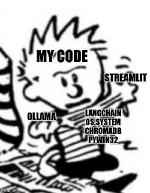

# Ollama LLM WebUI Integration

 
###### Or: A Hardware Engineer's Guide to Learning Large Language Models

## Introduction
This document details the process of developing a web-UI interface for interacting with a locally hosted LLM (gemma:2b). Provided below are the background, challenges and salient design decisions that accompanied the development process. Those interested in seeing a demonstration of the model can skip to the bottom, where a pair of links to videos are provided - the first has been edited to remove the long pauses where the machine is "thinking", while the second remains in uncut form to demonstrate the integrity of the model. All work completed for this project was done soley by myself (Cayton Larmer), made possible by extensive consultation of StackOverflow.

## Context and Problem Approach
It would be an understatement to say that working with large language models is outside the scope of my core competency; in fact, it would not be hyperbole to say that prior to starting on this project, *I had never directly interacted with a LLM at all*. However, my previous work with our university's robotics team has provided me with a great deal of practice engaging problems outside of my comfort zone. My first step was to address my total lack of context regarding work with LLMs - to this end, I found a comprehensive literature [See Ref. 1], which provided a fantastic overview of the development of language models over the past decade. This, coupled with an excellent video series by 3blue1brown [Ref. 2] gave me enough theoretical appreciation to at least develop more intelligent questions for Googling.
Armed with a newfound foundation, the problem statement provided began to resolve itself into three distinct and coupled challenged:

- I needed to source a language model that my 2021 ideapad could stand to run, and familiarize myself with the API. Ollama seemed an attractive approach both because it was open-source and because the Python library seemed concise (it was only later I would discover how incomplete it was)

- Using this language model, I needed to build a toolchain that would let me perform Retrieval Augmented Generation (RAG) with the model. I swiftly pinned this as being the most technically challenging part of the problem, and set it aside to engage with later.

- Lastly, I needed to tie all of the ""backend"" work with the language model into a webUI. Speaking candidly, this was the task that scared me the most - I have no affinity for web development or user interface design, and thus did not have prior experience with any relevant tools. However, I do have a friend working in data science who vouched for Streamlit as being a very out-of-box toolkit. This was the primary driver behind my decision to use it.

With the problems thus defined in my mind, I began to coarsely outline the structure of the program. My thought process was thus: Because I needed to become familiar with mutlitple libraries that all needed to interface with each other, I knew modularity and the ability to test code independently and automatically would be a massive asset. As you can see, the solution code is divided between two files: a Bot.py module, which contains all of the performative code responsible for actually interfacing with the language model, and a LlamaWebUI script which "glues" the different classes in the Bot module together to produce the desired functionality. Instituting this separation between functionality and program control lets me test each of my classes as they are developed, essentially independent of each other, which kept the workflow brisk.

## Design Decisions and Challenges
The first concrete code I wrote was for the ChatManager and ChatHistory classes. Having spent some time experimenting with ollama and streamlit to get a sense for the program structure, I realized that strict maintainance of program state and chat history would both be integral to keeping the model from getting "confused" by errors in context.

#### ChatHistory
In this vein, the ChatHistory class was designed as a wrapper for a list of dictionaries. Each entry contained information about the role ('user' or 'assistant') as well as the content of the message. Mutation of the ChatHistory was limited to popping and appending messages to the stack.

#### ChatManager
With the foundational data structure decided upon, it was time to implement a manager class to handle all interaction with the LLM. Because the chatbot needed to have at least two modes, I decided the most convenient way to handle this state dependancy was to inject it via a set of subclasses. The superclass (Source) would have a single callable method which accepted a prompt and context (in the form of the ChatHistory) and returned a string; the implementation details could thus be hidden in each subclass, allowing for diverse behavior without sacrificing testability. This frees up the ChatManager class to handle the initialization and finalization of the model and manage the read/write opreations on the ChatHistory.

In this vein, it is worth noting now one of the most baffling problems I encountered with this project - while the ollama python library provides a mechanism for starting the ollama server and client, there is no provision to *stop* either of these processes. Furthermore, the ollama server spawns additional child processes which are not cleaned up at program termination, leading to unpredictable behavior on subsequent program runs. These two facts together necessitated the inclusion of the os, subprocess, and win32 suite to handle this undesirable behavior, which is handled in the Startup() and Teardown() methods. Were I to repeat this project, I would definitely consider replacing the win32 dependencies with psutils, as the entire win32 suite is now legacy code.

#### Source and RagDB
With the overall program structure now well defined, the final implementation detail in the Bot module was to write classes for the default and RAG modes. Both classes are functionally identical, although the RAG class required substantially more initialization. Because each of these objects is intended to represent a static mode, I strove to make them as immutable as possible, with all salient fields initialized during object construction - after this, data should only ever be accessed, not mutated. 

The RagDB class merits some special discussion, since it required the most links in the toolchain. I changed my mind as to how I wanted to do RAG a couple of times - initially, I wanted to stick exclusively with ollama, but I quickly realized that the small permissible model size made that impractical. Subsequently, I tried implementing a fully langchain-based solution, but the performance using the ollama embedding model left much to be desired. I eventually settled on a bit of a hybrid toolchain, using langchain's beautifulsoup4 web scraper utilities to acquire and chunk data before passing it to chromadb to handle the embedding and vectorbase functionality. This works fantastically for such a small context length, although were I to redo this project I would definitely invest more time in learning about straining in BeautifulSoup - some webpages tend to return a lot of useless html tags, which the model will sometimes consider 'relevant' after embedding.

One challenge with developing the Source and RagDB classes which I remain dissatisfied with was the problem of passing context information. When writing the original source class, I realized that without appending the prompt to the ChatHistory log the model would not be able to 'see' the question being asked. This was trivial to manage inside the calling ChatManager method, but this problem worsened in the RAG mode since the Query method in RagDB required an additional level of processing (retreiving relevant chunks) to function. The eventual solution I developed was a smelly but performant one - when the Query method is called, the Source object appends the prompt (and any retrieved chunks) to the ChatHistory log, queries the model, and then pops the last appended entry from the log before returning the model's response. While this has not presented any errors thus far, were this code to be further developed I would strongly suspect this design choice to be a candidate for future trouble.

#### LlamaWebUI Driver
Having built and tested each class in the Bot module, it was time to tie everything together with the frontend. Streamlit offers a fantastic set of tools for building simply webUIs quickly and without worrying about the minutae of server hosting, and the stateless architecture actually made the programming feel coarsely familiar to working with a microcontroller. The main REPL structure is handled in the run() function, which in turn uses helper methods to parse the user input and write the running chat history to the screen. This division of labor between the read, evaluate and print functionality allowed for very swift development and progressive testing of the main script.

An ongoing issue I have with this script is how input is parsed, especially when changing modes. This single function - ParseInput - seems to be doing far too much, and the unintuitive return values belie this. Were I to re-write this, I would almost certainly refactor the function to return the state information (e.g. whether or not to quit the repl) and the 'notification' message via separate channels. It would also be wise to expand the WriteHistory method to be responsible for all updates to the web interface in each loop, rather than just printing the current chat history.
.
## Closing Thoughts
All taken together, I am happy with how this project turned out. I have been unable to find any bugs in my testing of the completed product, and from a software design standpoint my only regrets are abstract implementation details. While I am confident I could complete the 'extra credit' portion of the project (the highly modular structure of the Bot classes was in fact taking this into account), the slow performance of the model on my machine and extended timeframe of the project have convinced me to submit what I have and be happy with it.

This project, taking place in approx. 25 working hours over the course of 7 days, was one of many 'first's for me - first time working with a large language model, first time working with a web UI, et cetera. Back when I was first starting my degree in engineering, I had the opportunity to attend a speaker session with one of the Mechatronics team's alumni. Their keystone piece of advice for the next generation was that past a certain point, the prefix in front of the word 'engineer' on your diploma meant less than the word 'engineer' itself. Regardless of the context or discipline, the principal function of an engineer is to learn hard things quickly. I hope this project stands as a testament to my ability to do just that. 

## Model Demonstration
Link: [Cayton Larmer JSB AI Demo Video](https://drive.google.com/file/d/1he34J4OXKMwFqO9vC4-4BwAyUc2_C63H/view?usp=drive_link)

Link (UNCUT): [Cayton Larmer JSB AI Video Demo RAW](https://drive.google.com/file/d/1lDggN6u0OQzZyxzQtmOkS8oNXwddGs_Q/view?usp=drive_link)

Please find me at clarmer8530@sdsu.edu with questions. 
